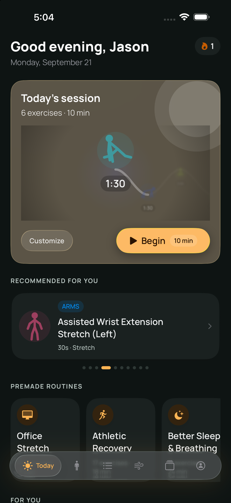
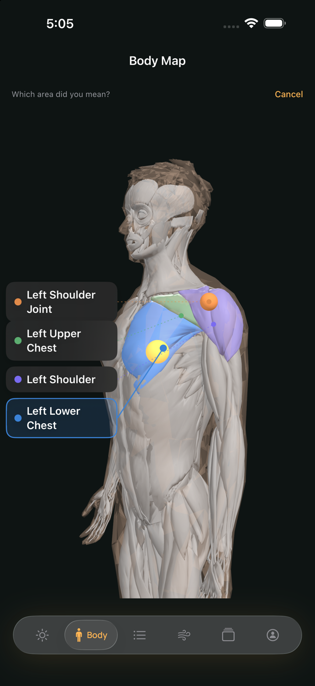
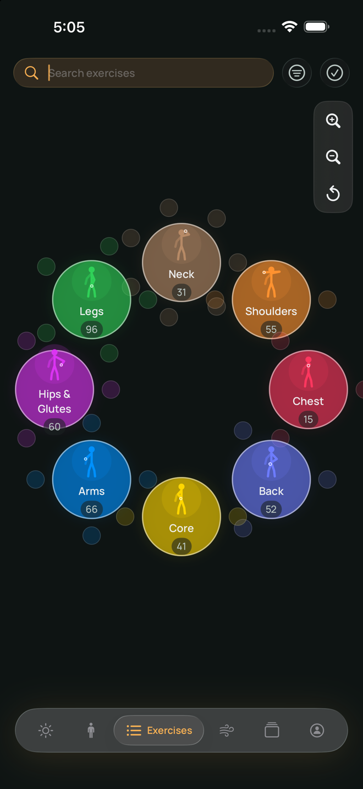
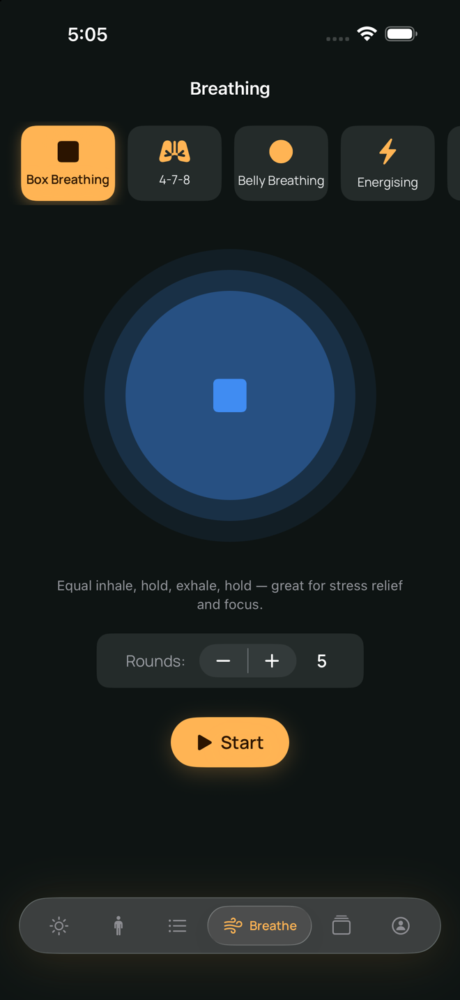

# Dial Down – Breath and Relax

A calm iOS app for breathing, stretching and body awareness. Tap a muscle on a 3D body map, see exactly which stretches work it, and follow guided sessions that pair movement with breath.

*(Formerly "Breath: Relax & Stretch" — the repository and Xcode project still use that name.)*

<p align="center">
  
  
  
  
</p>

## What it does

- **3D body map** — rotate an anatomical figure, tap a region or muscle, and jump straight to the exercises that target it. Mark your problem areas and the app tailors its suggestions.
- **372 exercises** — stretches grouped by Neck, Shoulders, Chest, Back, Core, Arms, Hips & Glutes and Legs. Most include a looping demo video rendered from the same anatomy model, with the working muscles highlighted.
- **Exercise graph** — a zoomable node-graph view of the whole library, alongside search, filters and a "For You" section.
- **Guided breathing** — Box, 4-7-8, Belly and Energising patterns, plus a custom pattern editor, with an animated pacing guide.
- **Session player** — step through a routine with countdowns, side-switch cues for one-sided stretches, optional voice cues and haptics.
- **Routines** — build your own, start from premade ones, share or import a routine, and challenge a friend.
- **Progress** — points, streaks, badges, charts, a flexibility check-in and an opt-in leaderboard. Optional HealthKit and Calendar integration and streak reminders.
- **Yours to keep** — export all your data from within the app.
- **Languages** — English, Spanish, French and Simplified Chinese, with an in-app language picker.

## Privacy

Local-first by design. Your sessions, routines, streaks and body-map marks live on your device in SwiftData. Signing in is optional; if you do, only a display name and progress stats keyed to an anonymous ID are sent to the backend. No tracking, no ads, no purchases. See [`PrivacyPolicy.html`](Breath%20-%20Relax%20%26%20Stretch/Legal/PrivacyPolicy.html) and [`TermsOfUse.html`](Breath%20-%20Relax%20%26%20Stretch/Legal/TermsOfUse.html).

## Tech

- **SwiftUI + SwiftData**, no third-party dependencies. Supabase is spoken to over raw `URLSession`.
- **SceneKit** for the 3D body map; the anatomy mesh is parsed off the main thread and hit-tested against muscle proxy volumes.
- **Lumina** — the in-house design system (`Views/Theme/`): dynamic colour tokens, a semantic Manrope type scale, shared card / pill / chip components, Dynamic Type and Reduce Motion support.
- **Auth** — Sign in with Apple, Google, or email, with an optional app lock (Face ID).
- **Backend** — [Supabase](https://supabase.com) (Postgres with row-level security, plus an Edge Function for streak-warning pushes). Schema in [`supabase_schema.sql`](supabase_schema.sql).
- **Asset pipeline** — the exercise demo videos are produced by Blender scripts in [`Tools/blender/`](Tools/blender), so they can be regenerated from source.

### Layout

```
Breath - Relax & Stretch/        App target
  Models/                        SwiftData models and domain types
  Services/                      Auth, Supabase, notifications, HealthKit, gamification
  Views/                         Home, BodyMap, Exercises, Breathing, Routines, Session, Profile, Onboarding, Theme
  Resources/                     Seed data, 3D models, demo videos, string catalog
  Legal/                         Privacy Policy, Terms, Credits (bundled HTML)
Breath - Relax & StretchTests/   Unit tests
Breath - Relax & StretchUITests/ UI tests
supabase/                        Edge Function and config
Tools/blender/                   Anatomy export and animation rendering scripts
docs/                            Design notes, plans and readiness checklists
```

## Building

Requirements: a recent Xcode with the iOS 26 SDK (the deployment target is iOS 26.5).

1. Clone the repo and open `Breath - Relax & Stretch.xcodeproj`.
2. Choose an iPhone simulator and run. The app works offline with no extra setup.
3. To run on a device, or to use Sign in with Apple, set your own Team and bundle identifier under *Signing & Capabilities*.
4. Run the tests from Xcode (⌘U), or with `xcodebuild test` against a simulator destination.

The Supabase URL and publishable key in `SupabaseService.swift` point at the author's project; row-level security is what protects the data. To use your own backend, create a Supabase project, run `supabase_schema.sql`, enable the Apple auth provider, and swap in your URL and key.

## Project status

Pre-release. See [`TODO.md`](TODO.md) for what is in progress; cross-device sync of sessions and routines is the main piece still being built.

## License

- **Source code** — [Mozilla Public License 2.0](LICENSE). Modified versions of MPL-licensed files must stay under MPL-2.0 when distributed; you can combine them with code under other licenses.
- **Body-map anatomy and exercise animations** — the 3D body map is built from [Z-Anatomy](https://www.z-anatomy.com), which is itself built on [BodyParts3D](https://dbarchive.biosciencedbc.jp/en/bodyparts3d/download.html) (© Kousaku Okubo / DBCLS). Both are licensed **CC BY-SA**, so the meshes, the metadata derived from them, and every exercise video rendered from them are distributed under [CC BY-SA 4.0](https://creativecommons.org/licenses/by-sa/4.0/) rather than MPL-2.0. This covers `Resources/Models3D/`, `Resources/Animations/`, `skinmuscle_node_names.json`, `musclegroup_hitboxes.json` and `Tools/blender/generated/`. The source was modified: skin patches welded into one shell, muscles decimated for mobile, objects regrouped into the app's muscle categories, and the result posed and rendered into the demo loops. Full credits and the list of changes are in [`ASSET_CREDITS.md`](ASSET_CREDITS.md).
- **Typeface** — [Manrope](https://github.com/sharanda/manrope), SIL Open Font License 1.1.

If you fork or redistribute anything derived from the anatomy assets, you must credit Z-Anatomy and BodyParts3D, link the CC BY-SA 4.0 license, say what you changed, and license your derivative under CC BY-SA 4.0 too.
